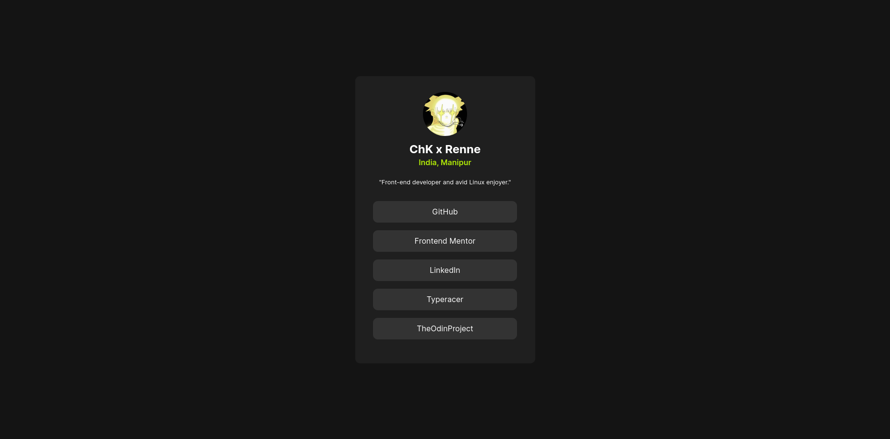

# Frontend Mentor - Social links profile solution

This is a solution to the [Social links profile challenge on Frontend Mentor](https://www.frontendmentor.io/challenges/social-links-profile-UG32l9m6dQ). Frontend Mentor challenges help you improve your coding skills by building realistic projects. 

## Table of contents

- [Overview](#overview)
  - [Screenshot](#screenshot)
  - [Links](#links)
- [My process](#my-process)
  - [Built with](#built-with)
  - [What I learned](#what-i-learned)
  - [Continued development](#continued-development)
- [Author](#author)
## Overview

### Screenshot



### Links

- Solution URL: [BitBucket](https://bitbucket.org/chkg2a0/social-links-profile)
- Live Site URL: [Netlify Live Preview](https://chk-social-links.netlify.app/)

## My process

### Built with

- Semantic HTML5 markup
- CSS custom properties
- Flexbox
- [React](https://reactjs.org/) - JS library

### What I learned

This is essentially my first time building a project as It's been many years ago since I've made a website. I used ReactJs for this proect, I don't remember much css but I'm also doing [TheOdinProject](https://www.theodinproject.com/) on the side, fundamental knowledge from the TheOdinProject is helping me alot in this project

I forgot how to center a div but essentially, this is how you do it.

```css
body {
    margin: 0;
}
.container {
    display: flex;
    height: 100vh;
    justify-content: center;
    align-items: center;
}
```
A very good habit to make box appear as you expect
```css
*, *::after, *::before {
    box-sizing: border-box;
}
html {
    box-sizing: inherit;
}
```

### Continued development
I'm still very new to this. But I'm willing to push on forwards. As there is so many interesting things to build. I'll try many projects from [frontendmentor.io](https://www.frontendmentor.io)


## Author

- Website - [ChK](https://chkxrenne.xyz)
- Frontend Mentor - [@chkg2a](https://www.frontendmentor.io/profile/chkg2a)
